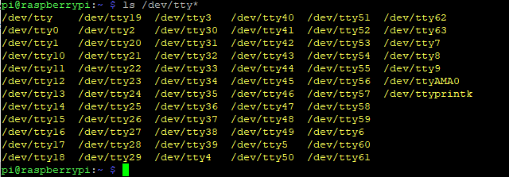
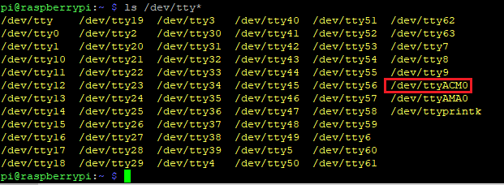

# Arduino_to_RaspberryPi_to_csv

These scripts will stream sensor data from an Arduino compatible board through serial to the Raspberry Pi. The Pi script will read the specific port of the Arduino-like board, format the lines, and write it to a csv file, with time stamps. This is done in real time and makes the arduino compatible board like an external sensor connected to the Pi as a data logger.

My Implementation consisted of a Sparkfun Razor 9df IMU printing accelerometer data to the serial port. I used a Raspberry Pi 4 running Python 3.7.3.

Use the commnad 'ls /dev/tty*' to identify the port for your device.

